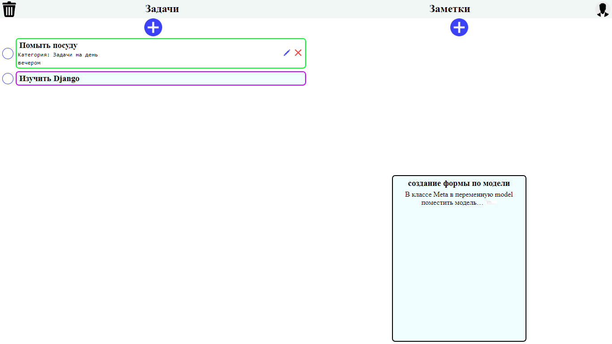
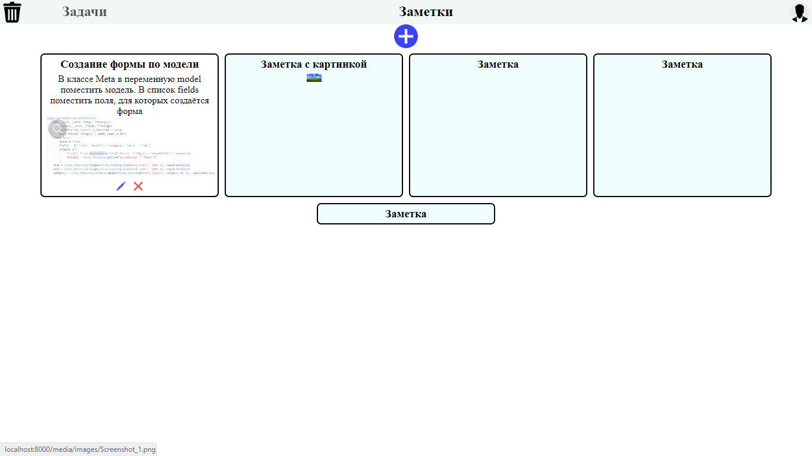
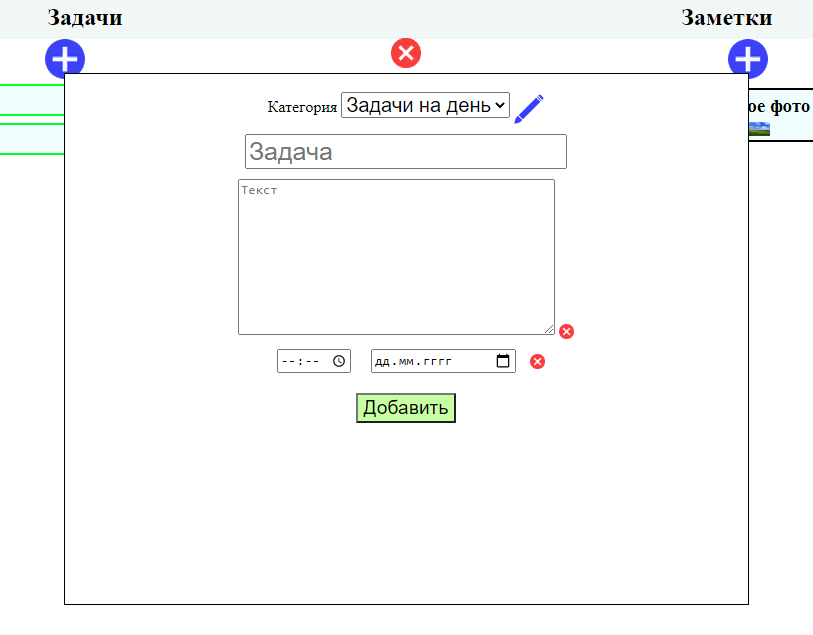
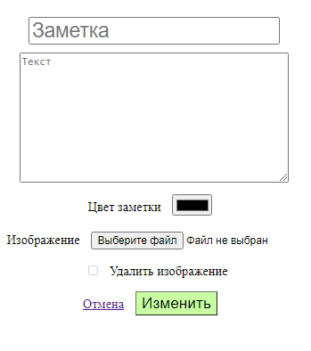

## Это удобный сервис, в котором можно хранить свои задачи и делать заметки
У задачи можно указать:
- название
- выбрать категорию (или создать новую)
    - у каждой категории можно изменить цвет, чтобы было удобнее ориентироваться
- добавить описание
- указать дату и время

- Задачу можно изменять после создания, неограниченное количество раз

У заметки можно указать:
- название
- добавить описание
- добавить картинку

На главной странице сразу отображаются и заметки и задачи. При желании можно отобразить только задачи или только заметки. Задачи можно отмечать выполнеными. Ненужные записи можно перемещать в корзину.

#### Запуск сервера
У вас должен быть установлен ```Python``` и установленны все ```requirements.txt```

Все команды выполняются из *Django_tasks-and-notes/*
Создание базы данных:
1. ```python manage.py makemigrations```
2. ```python manage.py makemigrations app```
3. ```python manage.py migrate```


Запуск сервера ```python manage.py runserver```


___
##### Скриншоты

___

___

___
